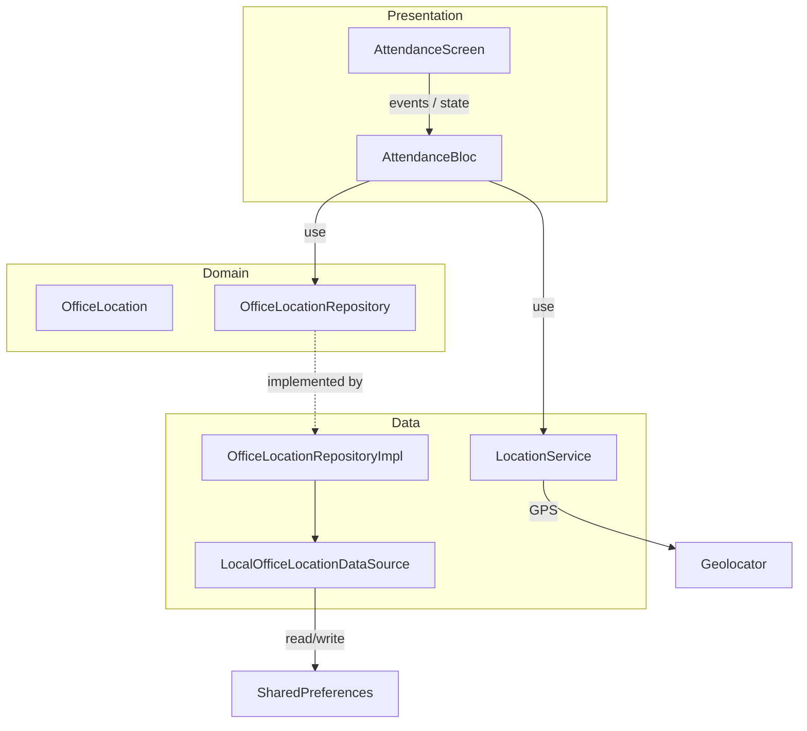

# Geo Attend — Technical README

A Flutter app that lets you set an office location and mark attendance only when you’re within 50 meters. This doc describes how it’s built: requirements, Clean Architecture, BLoC, and tests.

---

## What the app does (requirements)

- **Set office location** — One tap fetches GPS, saves coordinates locally (SharedPreferences).
- **Mark attendance** — Button is enabled only when your current location is within a **50 m** radius of the saved office.
- **Live distance** — Shows text like “You are 120 m away from the office” and updates as you move.
- **Errors** — Handles permission denied and location-off with clear messages and an option to open app settings.

**Tech choices:**

- **State management:** BLoC (flutter_bloc).
- **Architecture:** Clean Architecture (domain → data → presentation).
- **Local storage:** SharedPreferences.
- **Location:** geolocator (permissions + current position + position stream).

---

## Clean Architecture overview

The app is split into three layers. The UI talks only to the BLoC; the BLoC talks to the domain (repository interface) and to a location service; the data layer implements the repository and talks to SharedPreferences and the device.



- **Presentation** — One screen and one BLoC. The screen dispatches events and rebuilds from state.
- **Domain** — One entity (`OfficeLocation`) and one repository contract. No Flutter or platform imports.
- **Data** — Repository implementation, a local datasource (SharedPreferences), and a location service that wraps Geolocator.

Dependency direction: presentation → domain ← data. The BLoC depends on the repository *interface* and on `LocationService`; the concrete repository and location implementation live in the data layer.

---

## Project structure

```
lib/
├── main.dart                          # App entry, DI wiring, BlocProvider
├── core/
│   ├── constants.dart                 # 50 m radius, SharedPreferences keys
│   └── utils/
│       └── geo_utils.dart             # Haversine distance (meters)
└── features/
    └── attendance/
        ├── domain/
        │   ├── entities/
        │   │   └── office_location.dart
        │   └── repositories/
        │       └── office_location_repository.dart
        ├── data/
        │   ├── datasources/
        │   │   └── local_office_location_datasource.dart
        │   ├── repositories/
        │   │   └── office_location_repository_impl.dart
        │   └── services/
        │       └── location_service.dart
        └── presentation/
            ├── bloc/
            │   ├── attendance_bloc.dart
            │   ├── attendance_event.dart
            │   └── attendance_state.dart
            └── screens/
                └── attendance_screen.dart

test/
├── widget_test.dart                           # App loads, Attendance screen visible
├── attendance_state_test.dart                 # canMarkAttendance logic
├── geo_utils_test.dart                        # Haversine distance
└── local_office_location_datasource_test.dart # Save/load office and last attendance
```

---

## Layer-by-layer

### Domain

- **`OfficeLocation`** — Plain class: `latitude`, `longitude`, optional `savedAt`. Used as the geo-fence center and for “office set at …” in the UI.
- **`OfficeLocationRepository`** — Abstract interface:
  - `setOfficeLocation(OfficeLocation)`, `getOfficeLocation()`
  - `setLastAttendanceAt(DateTime)`, `getLastAttendanceAt()`

No Flutter or platform code here; only Dart and your own types. This keeps business rules and persistence contract separate from implementation.

### Data

- **`LocalOfficeLocationDataSource`** — Uses SharedPreferences to store/read office lat/lng and last attendance timestamp (ISO8601 string). Keys live in `AttendanceConstants`.
- **`OfficeLocationRepositoryImpl`** — Implements `OfficeLocationRepository` by delegating to the datasource. Translates between storage format and domain entity.
- **`LocationService`** — Wraps Geolocator: checks/requests permission, checks if location is enabled, gets current position (returns `OfficeLocation`), exposes `positionStream` for live updates. Throws `LocationServiceException` with user-facing messages so the BLoC can show them as-is.

All platform and plugin usage (SharedPreferences, geolocator) is confined to this layer.

### Presentation

- **Events** — `LoadSavedOffice` (on startup), `SetOfficeLocationRequested` (Set Office Location tap), `MarkAttendanceRequested` (Mark Attendance tap).
- **State** — `savedOffice`, `isLoading`, `errorMessage`, `distanceMeters`, `distanceError`, `attendanceMarkedAt`. Derived: `canMarkAttendance` = distance is not null and ≤ 50 m.
- **AttendanceBloc** —  
  - On `LoadSavedOffice`: loads office and last attendance from repository, then starts the distance stream if office exists.  
  - On `SetOfficeLocationRequested`: gets position from `LocationService`, saves via repository, then starts the distance stream.  
  - On `MarkAttendanceRequested`: if `canMarkAttendance`, saves `DateTime.now()` via repository and updates state.  
  - Subscribes to `LocationService.positionStream` when office is set; on each position, computes distance with `distanceInMeters` and emits it; on stream error, sets `distanceError`. Cancels the subscription in `close()`.
- **AttendanceScreen** — Single screen: distance text, office coordinates or “Office not set”, Set Office Location button (disabled while loading), Mark Attendance button (enabled only when `canMarkAttendance`), hints (“Set office location first” / “Move within 50 m…”), last marked time. Listens to state and shows error snackbars; for permission-related errors, adds a “Settings” action that opens app settings.

### Core

- **`AttendanceConstants`** — `attendanceRadiusMeters = 50`, and SharedPreferences keys for office lat/lng and last attendance.
- **`geo_utils.dart`** — `distanceInMeters(lat1, lng1, lat2, lng2)` using the Haversine formula (meters). Used by the BLoC for the live distance and for the 50 m check (via state’s `canMarkAttendance`).

---

## BLoC in practice

- **Creation** — In `main.dart`, after building the repository and `LocationService`, the app uses `BlocProvider` to create `AttendanceBloc` with those dependencies and dispatches `LoadSavedOffice` once.
- **Flow** — User actions (e.g. tap “Set Office Location”) cause the screen to dispatch an event. The bloc handles it (async work in the repository or location service), then emits a new state. The screen rebuilds from state; listeners show snackbars for errors and, when relevant, a “Settings” action.
- **Distance stream** — When the bloc has a saved office (after load or after setting it), it subscribes to `positionStream`. Each update is converted to a distance with `distanceInMeters` and emitted; that drives the “You are X m away” text and whether `canMarkAttendance` is true.

No business logic in the UI; the screen only maps state to widgets and maps gestures to events.

---

## Unit tests

Tests live under `test/` and use `flutter_test` (and `SharedPreferences.setMockInitialValues` where needed).

| File | What it covers |
|------|-----------------|
| **attendance_state_test.dart** | `AttendanceState.canMarkAttendance`: false when distance is null; true when distance &lt; 50 m; false when distance &gt; 50 m. |
| **geo_utils_test.dart** | `distanceInMeters`: ~0 for same point; ~111 m for 0.001° longitude at equator (known Haversine check). |
| **local_office_location_datasource_test.dart** | With mock SharedPreferences: saving and loading an `OfficeLocation`; saving and loading last attendance time (rounded to seconds). |
| **widget_test.dart** | App starts and the Attendance screen is shown (full widget pump with real repo and location service). |

Run everything with:

```bash
flutter test
```

---

## Running the app

- **Dependencies:** `flutter pub get`
- **Run:** `flutter run` (device or simulator with location)
- **Permissions:** Android needs `ACCESS_FINE_LOCATION`; iOS needs `NSLocationWhenInUseUsageDescription` (both are already in the project).

You’ll be prompted for location when you tap “Set Office Location.” After that, the distance updates in place and “Mark Attendance” enables only when you’re within 50 m of the saved office.

---

## Summary

Geo Attend is a single-feature app: one screen, one BLoC, one domain entity and repository, and a small data layer (SharedPreferences + location). Clean Architecture keeps the “where is the office and can I mark attendance?” logic in the domain and BLoC, and pushes platform details into the data layer. BLoC keeps the UI simple and testable, and the unit tests cover state rules, distance math, and persistence without touching the UI.
