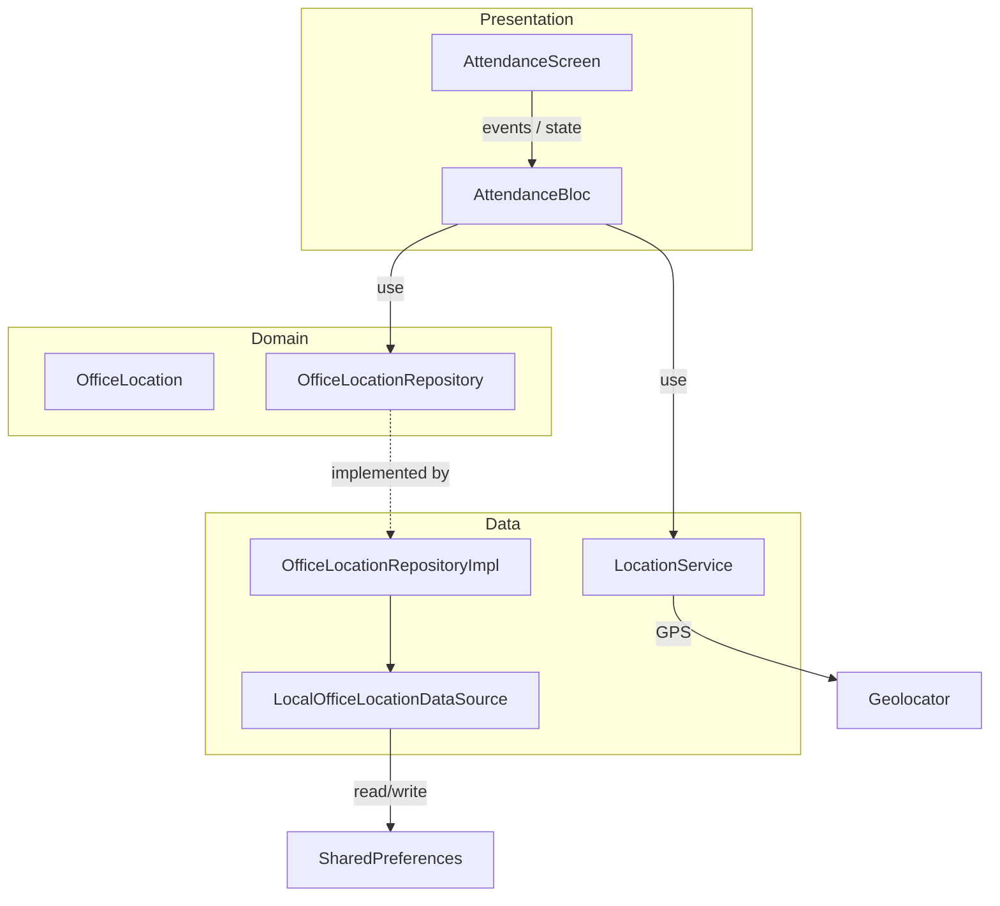
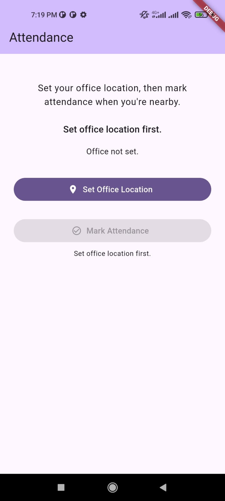
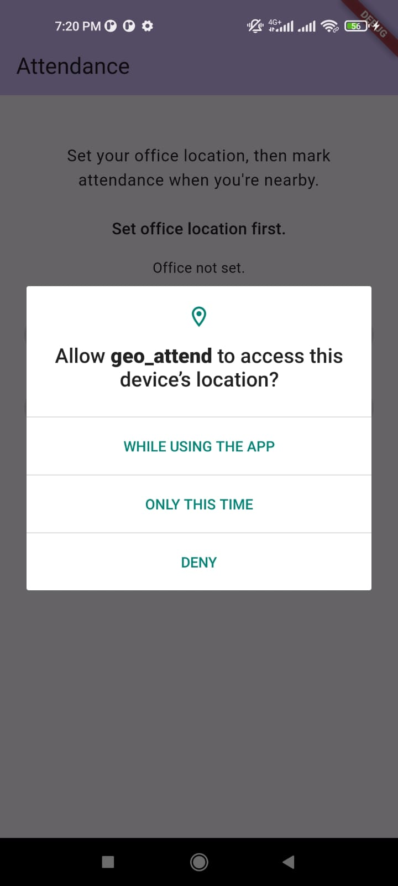
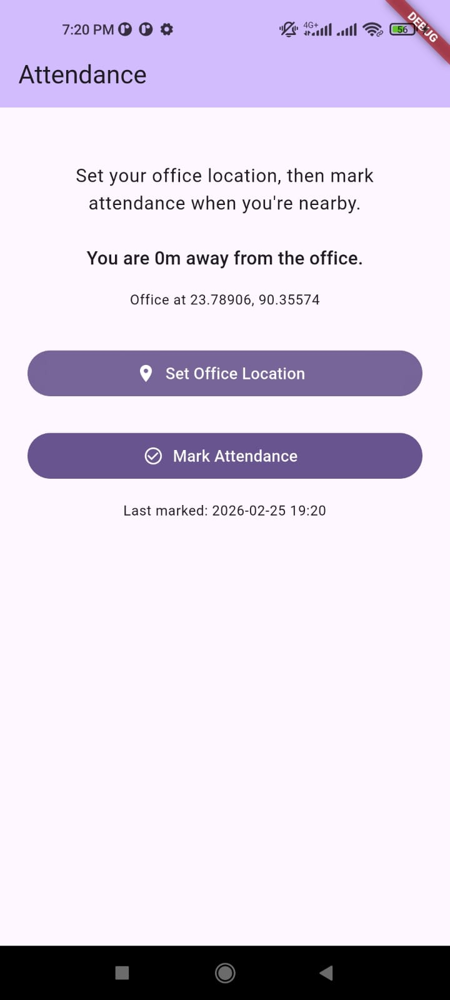

# Geo Attend – Geo‑Fenced Attendance System

A simple Flutter app that demonstrates a **geo‑fenced attendance flow**:

- The user sets an **office location** using the current GPS position.
- The app continuously tracks distance from that saved point.
- The user can only **mark attendance** when they are **within 50 meters** of the office.

This is implemented using **Clean Architecture + BLoC**, with local storage and a live GPS stream.

---

## 1. Project Title and Description

- **Title:** Geo Attend – Geo‑Fenced Attendance System  
- **Business requirement:**
  - **Setup Phase:**  
    - `Set Office Location` button reads the current GPS location and saves it locally as the office coordinate.
  - **Validation Phase:**  
    - `Mark Attendance` button is only enabled if the current location is within **50 meters** of the saved office.
  - **Feedback:**  
    - A live distance indicator shows text like **“You are 120m away from the office.”**

The whole flow happens on a single `AttendanceScreen`.

---

## 2. Technical Stack

**Framework / language**

- **Flutter** (Dart 3.8.x)

**State management**

- **BLoC pattern** via:
  - `flutter_bloc`
  - `bloc`

**Storage / device features**

- **SharedPreferences** – persists:
  - Office latitude / longitude
  - Last attendance timestamp
- **geolocator** – handles:
  - Location permissions
  - `getCurrentPosition()` for initial office set
  - `getPositionStream()` for the live distance indicator

**Utilities**

- **equatable** – clean value equality for BLoC events and state.

> Note: There is no HTTP / networking in this project; all logic is local (GPS + local storage).

---

## 3. Project Structure / Approaches

### Architectural approach

The app follows a small **Clean Architecture** variant with a **BLoC presentation layer**:

- **Presentation layer (Flutter + BLoC)**  
  - Widgets and BLoC classes only talk to abstractions and simple services.
- **Domain layer (pure Dart)**  
  - Entities and repository interfaces define the core rules.
- **Data layer (platform integration)**  
  - Concrete repository implementation, SharedPreferences datasource, and Geolocator‑based `LocationService`.

High‑level diagram:



### Main BLoC and flows

- **`AttendanceBloc`** (single BLoC for this feature)
  - **Key events**
    - `LoadSavedOffice` – on app start:
      - Loads office location and last attendance from the repository.
      - If an office is found, starts the GPS position stream.
    - `SetOfficeLocationRequested` – when the user taps **Set Office Location**:
      - Calls `LocationService.getCurrentPosition()`.
      - Stores the coordinates via `OfficeLocationRepository.setOfficeLocation`.
      - Starts listening to the position stream for live distance updates.
    - `MarkAttendanceRequested` – when the user taps **Mark Attendance**:
      - Only acts if `state.canMarkAttendance` is `true`.
      - Stores the current time via `setLastAttendanceAt`.
    - `DistanceChanged` – internal event dispatched from the GPS stream:
      - Updates `distanceMeters` in state.
    - `DistanceError` – internal event for stream errors:
      - Sets a friendly `distanceError` message.
  - **State (`AttendanceState`)**
    - `savedOffice` – the persisted office coordinates (or `null` if not set).
    - `distanceMeters` – live distance between current location and office.
    - `distanceError` – user‑friendly text when distance can’t be computed.
    - `attendanceMarkedAt` – last attendance timestamp.
    - `isLoading`, `errorMessage` – used for button loading and error snackbars.
    - `canMarkAttendance` (derived) – `true` only when:
      - `distanceMeters` is not null, and
      - `distanceMeters <= 50` (from `AttendanceConstants.attendanceRadiusMeters`).

### File‑level structure

```text
lib/
├── main.dart                          # App entry, DI wiring, BlocProvider
├── core/
│   ├── constants.dart                 # 50 m radius, SharedPreferences keys
│   └── utils/
│       └── geo_utils.dart             # Haversine distance (meters)
└── features/
    └── attendance/
        ├── domain/
        │   ├── entities/
        │   │   └── office_location.dart
        │   └── repositories/
        │       └── office_location_repository.dart
        ├── data/
        │   ├── datasources/
        │   │   └── local_office_location_datasource.dart
        │   ├── repositories/
        │   │   └── office_location_repository_impl.dart
        │   └── services/
        │       └── location_service.dart
        └── presentation/
            ├── bloc/
            │   ├── attendance_bloc.dart
            │   ├── attendance_event.dart
            │   └── attendance_state.dart
            └── screens/
                └── attendance_screen.dart
```

---

## 4. Generative AI Usage

This project was developed with assistance from generative AI as a **coding partner**, not as a full code generator.

- **Project bootstrapping & structure**: I used AI to discuss and validate the initial project structure (feature folders, BLoC layers, shared widgets) and to cross‑check that the architecture followed common clean/BLoC best practices.
- **Generic UI flows**: For standard UI patterns I asked AI for example patterns and then adapted the code to match my own coding style.
- **Technical implementation guidance**: For more complex pieces (state management wiring, responsiveness), I used AI to get guidelines, trade‑offs, and API reminders, then implemented and refined the final solution myself, validating that it aligned with Flutter and BLoC best practices.
- **Human review & ownership**: All architectural decisions, implementation details, and final code were reviewed, adjusted, and approved by me before being committed to the repository.

---

## 5. How to Run

### Prerequisites

- Flutter SDK installed and on your `PATH`.
- Android emulator, iOS simulator, or a physical device with location services.

### Steps

1. **Clone the repository**

   ```bash
   git clone <https://github.com/SaeefMinhaz/geo_attend.git>
   cd geo_attend
   ```

2. **Install dependencies**

   ```bash
   flutter pub get
   ```

3. **Run the app**

   ```bash
   flutter run
   ```

4. **Permissions**
   - On **Android**, you’ll be prompted for **location permission**; the app declares `ACCESS_FINE_LOCATION`.
   - On **iOS**, `NSLocationWhenInUseUsageDescription` is configured in `Info.plist`.

5. **Testing**

   ```bash
   flutter test
   ```

---

## 6. Screenshots

Screenshots live under `assets/screenshots/` and illustrate the full flow:

- **Initial screen**

  

- **Location permission prompt**

  

- **Office location set (shows coordinates and distance)**  

  

- **Attendance successfully marked (button enabled within 50 m)**  

  

These give a quick visual of the Setup Phase (setting office), Validation Phase (distance + button enabling), and the final marked‑attendance state.
